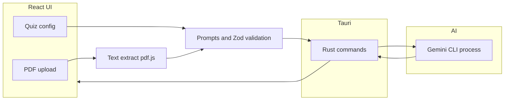

**Languages:** [English](README.md) · [Türkçe](README.tr.md)

# QuizLab Med — AI quizzes from PDFs (Tauri desktop)

**QuizLab Med** is a **Tauri 2** desktop app that turns **PDF lecture notes and books** into **customizable, AI-generated quizzes** and **flashcards** for study. It targets **medical and academic** workflows (and any PDF-heavy course material). You upload a PDF; the app extracts text, builds prompts, and runs **Google Gemini** through the **Gemini CLI** — not through a bundled API key or browser SDK.

**Window title:** QuizLab · **Bundle identifier:** `com.quizlab.med` · **Package version:** `1.0.0` (see `package.json`).

## Table of contents

- [What this app does](#what-this-app-does)
- [Features](#features)
- [How it works](#how-it-works)
- [Project layout](#project-layout)
- [Tech stack](#tech-stack)
- [Prerequisites](#prerequisites)
- [Installation](#installation)
- [npm scripts](#npm-scripts)
- [Development](#development)
- [Production build](#production-build)
- [Configuration notes](#configuration-notes)
- [Troubleshooting](#troubleshooting)
- [Security and privacy](#security-and-privacy)
- [FAQ](#faq)
- [References](#references)

## What this app does

1. You select or drag in a **PDF** (notes, slides export, textbook chapter).
2. The UI reads the document with **pdf.js**, enforces **size and page limits**, and lets you tune **difficulty**, **question count**, **Gemini model**, optional **focus topic**, and **example question style**.
3. The desktop shell invokes the **Gemini CLI** via Tauri (Rust side). Your **API credentials live in the CLI / OS environment**, not inside the compiled app.
4. You take the **quiz**, review **explanations**, use **flashcards**, export or continue sessions depending on the build.

**Important:** Running `npm run dev` (Vite only) **cannot** call the Gemini pipeline; AI features require the **Tauri** app so `invoke('gemini_run', …)` works.

## Features

| Area | Details |
|------|---------|
| **PDF input** | Drag-and-drop or file picker; text extraction with **pdf.js**. Hard limits: **20 MB** file size, **500 pages** (`constants/pdfLimits.ts`). |
| **Quiz generation** | Multiple-choice questions with configurable **difficulty**, **count**, and **style**; several **Gemini** models (labels in the UI: Pro, Flash, Flash-Lite variants, etc.). |
| **Focus topic** | Narrow generation to a phrase (e.g. organ system, histology topic) instead of the whole PDF. |
| **Style cloning** | Provide an example question so the model can mimic tone and format. |
| **Flashcards** | Generate cards from key concepts in the text. |
| **Learning loop** | Per-question feedback, solution-style explanations, optional chat-style assistance where implemented. |
| **Localization** | UI strings in **Turkish** and **English** (`constants/translations.ts`). |
| **Session** | Demo quiz flow and resume for in-progress quizzes (state in Zustand stores). |
| **Desktop UX** | Native window via **Tauri**; dialogs via `@tauri-apps/plugin-dialog`. |

## How it works



- **Frontend:** React 19 + Vite 6 + Tailwind 4; state with **Zustand**; motion with **Framer Motion**.
- **Bridge:** TypeScript calls `runGeminiCli` in `services/gemini/cli.ts`, which `invoke`s the Rust command `gemini_run` with model id, stdin payload, and prompt tail.
- **Rust:** Spawns/monitors the `gemini` (or `npx`) process; supports **abort** for long runs (`abort_gemini_run`).

## Project layout

| Path | Role |
|------|------|
| `App.tsx`, `index.tsx` | App shell, routing, error boundary |
| `views/` | Screens: landing, config, generating, quiz, flashcards, results |
| `components/` | Forms, quiz UI, modals, quiz-config blocks |
| `services/` | PDF (`pdfService`, `pdfjsWorker`), flows (`appFlows`), Gemini (`gemini/`, `geminiService`) |
| `store/` | Global state: generation, quiz session, settings, CLI status, routing |
| `constants/` | Translations, PDF limits, demo data |
| `utils/` | Text helpers, parsing AI output, toasts |
| `src-tauri/` | Tauri 2 Rust project, icons, `tauri.conf.json` |

## Tech stack

| Layer | Technologies |
|--------|----------------|
| Frontend | [Vite](https://vitejs.dev/) 6, [React](https://react.dev/) 19, TypeScript, [Tailwind CSS](https://tailwindcss.com/) 4, [Framer Motion](https://www.framer.com/motion/), [Zustand](https://github.com/pmndrs/zustand), [pdfjs-dist](https://github.com/mozilla/pdf.js), [Zod](https://zod.dev/), [jspdf](https://github.com/parallax/jsPDF) (export paths where used) |
| Desktop | [Tauri](https://v2.tauri.app/) 2, Rust |
| AI | [Google Gemini CLI](https://github.com/google-gemini/gemini-cli) (`@google/gemini-cli`) |

## Prerequisites

- **[Node.js](https://nodejs.org/)** — LTS recommended (includes `npm` / `npx`).
- **[Rust](https://rustup.rs/)** — stable toolchain with **Cargo** (required for `tauri dev` / `tauri build`).
- **Gemini CLI** — install globally so the app can find `gemini` on PATH:

  ```bash
  npm install -g @google/gemini-cli
  gemini --version
  ```

  The app resolves `gemini` / `gemini.cmd` first; if missing, it uses **`npx -y @google/gemini-cli`**. Keep **Node** and **`npx` on PATH** — shortcuts that launch the built `.exe` may not see a global npm prefix; the `npx` path is the usual fix. Authenticate the CLI with your **Google account** or **API key** per [Gemini CLI](https://github.com/google-gemini/gemini-cli) docs.

- **Optional:** `cargo install tauri-cli` to use `cargo tauri` directly; otherwise the repo uses **`npx @tauri-apps/cli`** via npm scripts.

## Installation

Clone the repository, then:

```bash
npm install
```

## npm scripts

| Script | Command | Purpose |
|--------|---------|---------|
| `dev` | `vite` | Web dev server only (port from Vite config; AI **disabled**). |
| `build` | `vite build` | Production frontend bundle to `dist/`. |
| `preview` | `vite preview` | Preview the built static site. |
| `tauri` | `tauri` | Pass-through to Tauri CLI. |
| `tauri:dev` | `tauri dev` | **Recommended:** Vite + Tauri window + Gemini bridge. |
| `tauri:build` | `tauri build` | Create installers / bundles under `src-tauri/target/release/bundle/`. |

## Development

Full desktop experience (PDF + AI):

```bash
npm run tauri:dev
```

The dev server URL is configured in `src-tauri/tauri.conf.json` (default `http://localhost:3000`).

Frontend-only (UI work, **no** `gemini_run`):

```bash
npm run dev
```

If you see errors about Tauri or `invoke`, you are not running inside the Tauri shell — use `tauri:dev`.

## Production build

```bash
npm run tauri:build
```

Artifacts appear under:

- `src-tauri/target/release/` — binaries
- `src-tauri/target/release/bundle/` — platform bundles (e.g. Windows **`.msi`** / **`.exe`** installers, depending on targets)

## Configuration notes

- **Tauri:** `src-tauri/tauri.conf.json` — window size, `identifier`, `frontendDist`, dev URL.
- **Vite:** `vite.config.ts` — React plugin, Tailwind, aliases.
- **PDF limits:** `constants/pdfLimits.ts` — change only with matching UX copy in translations.

## Troubleshooting

| Symptom | What to try |
|--------|-------------|
| “CLI not found” / generation never starts | Run `gemini --version` in a normal shell; reinstall CLI; ensure `npx` works: `npx -y @google/gemini-cli --version`. |
| Works in terminal but not from app shortcut | PATH differs for GUI processes; add Node/npm to system PATH or rely on `npx` fallback. |
| `invoke` / Tauri errors in browser | You ran `npm run dev` — use `npm run tauri:dev`. |
| PDF rejected | Check **20 MB** and **500 page** caps; split or compress the PDF. |
| Slow or timed-out generation | Use a faster model tier in settings; reduce question count; shorten focus scope. |

## Security and privacy

- **No embedded API key** in the shipped web assets for Gemini: generation goes through the **CLI**, configured on the user machine.
- **PDF content** is processed locally for extraction; prompts are sent to Gemini according to your CLI / Google account policies.
- Review Google’s terms for **Gemini** and **CLI** usage for your institution or patient data scenarios.

## FAQ

**Why is there no API key inside the app?**  
The design delegates auth to **Gemini CLI**, keeping secrets out of the frontend bundle.

**How do I verify Gemini CLI?**  
`gemini --version` in a terminal; the desktop UI may show CLI status (see settings / landing sections).

**Why doesn’t `npm run dev` generate quizzes?**  
The Rust command that spawns Gemini is only available in the **Tauri** runtime.

**What file types are supported?**  
**PDF** is the primary path; limits are shown in the uploader hint.

## References

- [Gemini CLI on GitHub](https://github.com/google-gemini/gemini-cli)
- [Tauri 2 documentation](https://v2.tauri.app/)
