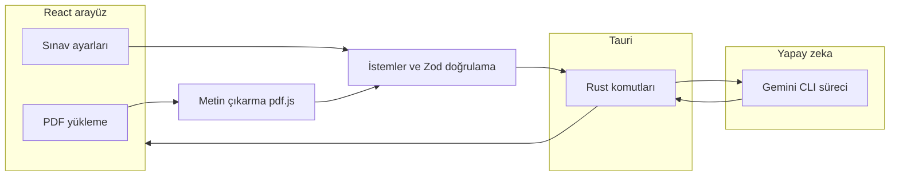

**Diller:** [Türkçe](README.tr.md) · [English](README.md)

# QuizLab Med — PDF’ten yapay zeka ile özelleştirilebilir sınav

**QuizLab Med**, **tıp ve akademik** PDF materyallerinden (ders notu, slayt çıktısı, kitap bölümü) **yapay zeka destekli, özelleştirilebilir sınavlar** ve **akıllı kartlar** üretmek için geliştirilmiş **Tauri 2** masaüstü uygulamasıdır. PDF yüklenir, metin çıkarılır, isteğe bağlı **odak konu** ve **örnek soru stili** ile üretim ayarlanır; sorular **Google Gemini** üzerinden **Gemini CLI** ile çalıştırılır — uygulama paketine `GEMINI_API_KEY` gömülmez, tarayıcı içi `@google/genai` kullanılmaz.

**Pencere adı:** QuizLab · **Uygulama kimliği:** `com.quizlab.med` · **Paket sürümü:** `1.0.0` (`package.json`).

## İçindekiler

- [Uygulama ne yapar](#uygulama-ne-yapar)
- [Özellikler](#özellikler)
- [Nasıl çalışır](#nasıl-çalışır)
- [Proje yapısı](#proje-yapısı)
- [Teknoloji](#teknoloji)
- [Önkoşullar](#önkoşullar)
- [Kurulum](#kurulum)
- [npm betikleri](#npm-betikleri)
- [Geliştirme](#geliştirme)
- [Üretim derlemesi](#üretim-derlemesi)
- [Yapılandırma notları](#yapılandırma-notları)
- [Sorun giderme](#sorun-giderme)
- [Güvenlik ve gizlilik](#güvenlik-ve-gizlilik)
- [Sık sorulan sorular](#sık-sorulan-sorular)
- [Referanslar](#referanslar)

## Uygulama ne yapar

1. **PDF** seçilir veya sürüklenip bırakılır (not, sunum PDF’i, ders materyali).
2. Arayüz belgeyi **pdf.js** ile okur; **boyut ve sayfa üst sınırları** uygulanır; **zorluk**, **soru sayısı**, **Gemini modeli**, isteğe bağlı **odak konu** ve **örnek soru stili** ayarlanır.
3. Masaüstü kabuk, Tauri (Rust) üzerinden **Gemini CLI** sürecini başlatır. **API kimlik bilgileri CLI / işletim sistemi ortamında** kalır, derlenmiş uygulama içine gömülmez.
4. **Sınav** çözülür, **açıklamalar** ve **akıllı kartlar** kullanılır; oturum durumu uygulama akışına göre sürdürülebilir.

**Önemli:** Yalnızca `npm run dev` (salt Vite) ile **Gemini köprüsü çalışmaz**; yapay zeka özellikleri için **Tauri** ile `invoke('gemini_run', …)` gerekir.

## Özellikler

| Alan | Açıklama |
|------|----------|
| **PDF girişi** | Sürükle-bırak veya dosya seçimi; **pdf.js** ile metin çıkarma. Sabit limitler: **20 MB** dosya boyutu, **500 sayfa** (`constants/pdfLimits.ts`). |
| **Sınav üretimi** | Çoktan seçmeli sorular; **zorluk**, **adet**, **stil**; arayüzde etiketlenen birden fazla **Gemini** modeli (Pro, Flash, Flash-Lite vb.). |
| **Odak konu** | Tüm PDF yerine belirli bir ifadeye (ör. organ, histoloji konusu) göre üretim. |
| **Stil taklidi** | Örnek soru vererek ton ve biçimi modele aktarma. |
| **Akıllı kartlar** | Metindeki kavramlardan kart üretimi. |
| **Öğrenme döngüsü** | Soru bazlı geri bildirim, çözüm tarzı açıklamalar; ilgili yerlerde sohbet tarzı yardım. |
| **Yerelleştirme** | Arayüz **Türkçe** ve **İngilizce** (`constants/translations.ts`). |
| **Oturum** | Demo sınav ve yarım kalan sınav akışları (Zustand mağazaları). |
| **Masaüstü** | **Tauri** penceresi; `@tauri-apps/plugin-dialog` ile dosya diyalogları. |

## Nasıl çalışır



- **Ön uç:** React 19 + Vite 6 + Tailwind 4; durum için **Zustand**; animasyon için **Framer Motion**.
- **Köprü:** `services/gemini/cli.ts` içindeki `runGeminiCli`, Rust tarafında `gemini_run` komutunu `invoke` eder (model, stdin, prompt parçası).
- **Rust:** `gemini` veya `npx` sürecini yönetir; uzun işlemler için **iptal** desteği (`abort_gemini_run`).

## Proje yapısı

| Yol | Görev |
|-----|--------|
| `App.tsx`, `index.tsx` | Uygulama kabuğu, yönlendirme, hata sınırı |
| `views/` | Ekranlar: landing, yapılandırma, üretim, sınav, kartlar, sonuçlar |
| `components/` | Formlar, sınav arayüzü, modallar, quiz-config blokları |
| `services/` | PDF (`pdfService`, `pdfjsWorker`), akışlar (`appFlows`), Gemini (`gemini/`, `geminiService`) |
| `store/` | Genel durum: üretim, sınav oturumu, ayarlar, CLI durumu, yönlendirme |
| `constants/` | Çeviriler, PDF limitleri, demo veriler |
| `utils/` | Metin yardımcıları, AI çıktısı ayrıştırma, toast |
| `src-tauri/` | Tauri 2 Rust projesi, simgeler, `tauri.conf.json` |

## Teknoloji

| Katman | Araçlar |
|--------|---------|
| Ön uç | [Vite](https://vitejs.dev/) 6, [React](https://react.dev/) 19, TypeScript, [Tailwind CSS](https://tailwindcss.com/) 4, [Framer Motion](https://www.framer.com/motion/), [Zustand](https://github.com/pmndrs/zustand), [pdfjs-dist](https://github.com/mozilla/pdf.js), [Zod](https://zod.dev/), [jspdf](https://github.com/parallax/jsPDF) (dışa aktarma akışlarında) |
| Masaüstü | [Tauri](https://v2.tauri.app/) 2, Rust |
| Yapay zeka | [Google Gemini CLI](https://github.com/google-gemini/gemini-cli) (`@google/gemini-cli`) |

## Önkoşullar

- **[Node.js](https://nodejs.org/)** — LTS önerilir (`npm` / `npx` dahil).
- **[Rust](https://rustup.rs/)** — **Cargo** ile birlikte (`tauri dev` / `tauri build` için gerekli).
- **Gemini CLI** — global kurulum:

  ```bash
  npm install -g @google/gemini-cli
  gemini --version
  ```

  Uygulama önce `gemini` / `gemini.cmd` yolunu dener; yoksa **`npx -y @google/gemini-cli`** kullanır. **Node** ve **`npx` PATH’te** olmalıdır; masaüstü kısayolu global npm önekini görmeyebilir. Google hesabı veya API anahtarı ile **CLI** tarafında oturum: [Gemini CLI](https://github.com/google-gemini/gemini-cli).

- **İsteğe bağlı:** `cargo install tauri-cli` ile `cargo tauri`; aksi halde **`npx @tauri-apps/cli`** npm betikleriyle kullanılır.

## Kurulum

Depoyu klonladıktan sonra:

```bash
npm install
```

## npm betikleri

| Betik | Komut | Amaç |
|-------|--------|------|
| `dev` | `vite` | Yalnızca web geliştirme sunucusu (yapay zeka **kapalı**). |
| `build` | `vite build` | Üretim ön yüz paketi → `dist/`. |
| `preview` | `vite preview` | Derlenmiş statik site önizlemesi. |
| `tauri` | `tauri` | Tauri CLI’ye doğrudan iletim. |
| `tauri:dev` | `tauri dev` | **Önerilen:** Vite + Tauri penceresi + Gemini köprüsü. |
| `tauri:build` | `tauri build` | `src-tauri/target/release/bundle/` altında kurulum paketleri. |

## Geliştirme

Tam masaüstü deneyimi (PDF + yapay zeka):

```bash
npm run tauri:dev
```

Geliştirme URL’si `src-tauri/tauri.conf.json` içinde tanımlıdır (varsayılan `http://localhost:3000`).

Yalnızca ön yüz (arayüz çalışması; **`gemini_run` yok**):

```bash
npm run dev
```

Tauri veya `invoke` hatası alıyorsanız uygulama Tauri kabuğunda çalışmıyordur — `tauri:dev` kullanın.

## Üretim derlemesi

```bash
npm run tauri:build
```

Çıktılar:

- `src-tauri/target/release/` — ikililer
- `src-tauri/target/release/bundle/` — platform paketleri (ör. Windows **`.msi`** / **`.exe`**)

## Yapılandırma notları

- **Tauri:** `src-tauri/tauri.conf.json` — pencere boyutu, `identifier`, `frontendDist`, geliştirme URL’si.
- **Vite:** `vite.config.ts` — React eklentisi, Tailwind, takma adlar.
- **PDF limitleri:** `constants/pdfLimits.ts` — değişiklikte çeviri metinleriyle uyum gözetin.

## Sorun giderme

| Belirt | Ne yapmalı |
|--------|------------|
| “CLI yok” / üretim başlamıyor | Shell’de `gemini --version`; CLI’yi yeniden kurun; `npx -y @google/gemini-cli --version` deneyin. |
| Terminalde çalışıyor, kısayoldan değil | GUI süreçleri farklı PATH kullanır; Node’u sistem PATH’ine ekleyin veya `npx` yedeğine güvenin. |
| Tarayıcıda `invoke` / Tauri hatası | `npm run dev` kullanıyorsunuz — `npm run tauri:dev` kullanın. |
| PDF reddedildi | **20 MB** ve **500 sayfa** sınırlarını kontrol edin; PDF’i bölün veya sıkıştırın. |
| Yavaş veya zaman aşımı | Ayarlarda daha hızlı model; soru sayısını azaltın; odak kapsamını daraltın. |

## Güvenlik ve gizlilik

- Üretim ön yüzünde **gömülü Gemini API anahtarı yok**; çağrılar **Gemini CLI** üzerinden, kullanıcı makinesinde yapılandırılır.
- **PDF içeriği** çıkarma için yerelde işlenir; istemler Gemini’ye CLI / Google politikalarınıza tabi olarak gider.
- Kurum veya hasta verisi senaryolarında **Google Gemini** ve **CLI** kullanım şartlarını inceleyin.

## Sık sorulan sorular

**Neden uygulama içinde API anahtarı yok?**  
Tasarım, kimlik bilgisini **Gemini CLI** ve kullanıcı ortamına bırakır; anahtar ön yüz paketine konmaz.

**Gemini CLI kurulumunu nasıl doğrularım?**  
Terminalde `gemini --version`; masaüstü arayüzünde CLI durumu (ayarlar / ana sayfa bölümleri) görülebilir.

**`npm run dev` ile neden sınav üretilmiyor?**  
Gemini sürecini başlatan Rust komutu yalnızca **Tauri** çalışma zamanında kullanılabilir.

**Hangi dosya türleri desteklenir?**  
Akış **PDF** odaklıdır; limitler yükleme ekranındaki ipuçlarıyla uyumludur.

## Referanslar

- [Gemini CLI (GitHub)](https://github.com/google-gemini/gemini-cli)
- [Tauri 2 belgeleri](https://v2.tauri.app/)
